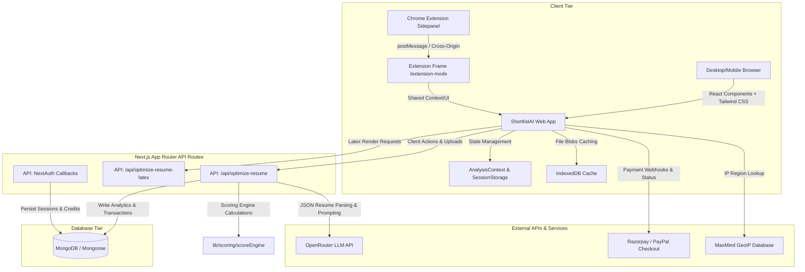

# 🎯 ShortlistAI — Production-Grade AI Resume Builder & ATS Optimizer

ShortlistAI is a full-cycle, AI-powered resume builder and Applicant Tracking System (ATS) optimization platform. It goes beyond simple keyword matching by implementing a deterministic heuristic scoring engine, semantic search capabilities, structural fit analysis, real-time interactive optimization templates (React & LaTeX), and a companion Chrome Extension to analyze job descriptions directly from job boards.

---

## 🚀 Live Preview
Explore the live web application here: [https://resume-virid-iota.vercel.app/](https://resume-virid-iota.vercel.app/)

---

## 🏗️ Technical Architecture & Ecosystem

ShortlistAI is built with a highly decoupled, modern stack utilizing Next.js 14 App Router, NextAuth.js, Mongoose, and a companion Chrome extension.



---

## 🧠 The Scoring Engine (`lib/scoring/scoreEngine.ts`)

Unlike standard AI solutions that offer arbitrary scores via LLM prompting, ShortlistAI employs a transparent **glass-box deterministic heuristic engine** in [scoreEngine.ts](file:///c:/Users/shamb/Documents/Resume%20projects/ShortlistAI-main/lib/scoring/scoreEngine.ts). 

### 1. Granular Score Breakdown
The raw ATS score is calculated out of **100 points** based on the following weighted criteria:
*   **Skills Matching (35%)**: Measures relevance and matching depth of candidate skills against required keywords.
*   **Experience Alignment (20%)**: Computes years of experience ratios and seniority level fits.
*   **Education Check (15%)**: Assesses degree equivalence and premium tier institution boosts.
*   **Responsibility Fit (15%)**: Compares task-level verbs and description overlaps.
*   **Job Title Consistency (10%)**: Verifies alignment between candidate's past titles and target roles.
*   **Formatting Signals (5%)**: Checks parseability metrics, contact details presence, and standard heading layouts.

### 2. Heuristics & Mathematics
*   **Base Match Quality ($W_{match}$)**:
    *   `exact` match = $1.0$ weight multiplier
    *   `synonym` match (e.g. *React* $\leftrightarrow$ *React.js*) = $0.9$ weight multiplier
    *   `related` match (semantic association) = $0.6$ weight multiplier
*   **Location Boost ($B_{location}$)**:
    Skills placed in high-priority zones of the resume receive localized multipliers:
    *   Found in *Job Title*: $+0.3$
    *   Found in *Professional Summary*: $+0.2$
    *   Found in *Skills Section*: $+0.2$
    *   Found in *Recent Work Experience*: $+0.2$
    *   *Mathematical Formula*: $B_{location} = \min(1.6, 1.0 + \sum \Delta_{boost})$
*   **Top 10 Skill Multiplier**:
    The top 10 required skills (ordered by importance) are marked as critical and receive a **$1.5\times$ weight boost** in the skills subscore calculation.
*   **Structural Fit Gate**:
    Calculates if a candidate meets baseline structural requirements based on:
    *   Absence of missing must-have skills (importance level = 3).
    *   Candidate's experience duration ($Y_{candidate}$) meets $\geq 70\%$ of the required experience duration ($Y_{required}$).
    *   Target minimum education level met.
    
    If `structuralFit` is evaluated to `false`, the candidate's **Potential Score** is capped at **$60$** (preventing misleading optimizations if fundamental prerequisites are missing).

### 3. Non-Linear Callback Probability Curve
The raw ATS match score is translated into a realistic interview callback probability percentage using a segmented curve. This ensures progression reflects real-world hiring statistics:

$$\text{Probability}(S) = \begin{cases} 
10 + \frac{S}{30} \times 15, & S < 30 \\
25 + \frac{S - 30}{20} \times 20, & 30 \le S < 50 \\
45 + \frac{S - 50}{20} \times 25, & 50 \le S < 70 \\
70 + \frac{S - 70}{15} \times 17, & 70 \le S < 85 \\
\min(95, 87 + \frac{S - 85}{15} \times 8), & S \ge 85 
\end{cases}$$

*(An adjustment step ensures the probability is bounded to be at least 5 points below the raw ATS score $S$ to maintain statistical reliability.)*

---

## 🔌 Companion Chrome Extension Assistant

Located in [shortlist-extension/](file:///c:/Users/shamb/Documents/Resume%20projects/ShortlistAI-main/shortlist-extension/), the browser extension allows users to analyze job boards (LinkedIn, Indeed, Glassdoor) seamlessly.

*   **Active Tab Extraction**: Injected background content scripts parse the active window's HTML using `chrome.scripting.executeScript` to retrieve job description text dynamically.
*   **Secure Cross-Origin Communication**: The sidepanel component embeds the ShortlistAI iframe page (`/extension-mode`). It transmits extracted details securely via HTML5 `window.postMessage` targeted specifically to `https://shortlistai.cv`.
*   **Retry Sync Routine**: To circumvent slow iframe React hydration, `sidepanel.js` triggers an active polling routine, checking if the receiver frame is loaded before clearing the communication interval.

---

## 🗄️ Database Design (Mongoose Models)

The data models are optimized for schema flexibility, concurrent credit ledgers, and fast geographic queries.

*   **[User Schema](file:///c:/Users/shamb/Documents/Resume%20projects/ShortlistAI-main/models/User.ts)**: Stores profile info, auth providers, onboarding flags (to control `driver.js` tours), and atomic credit balance updates.
*   **[Product Schema](file:///c:/Users/shamb/Documents/Resume%20projects/ShortlistAI-main/models/Product.ts)**: Implements dynamic regional pricing matrices (supporting USD, INR, EUR, etc.), billing intervals, and payment gateway subscriptions configuration (PayPal/Razorpay Plan IDs).
*   **[Transaction Schema](file:///c:/Users/shamb/Documents/Resume%20projects/ShortlistAI-main/models/Transaction.ts)**: Tracks payment gateways callbacks, payment status (`pending`, `completed`, `failed`), and applied promotional coupons.
*   **[AnalysisResult Schema](file:///c:/Users/shamb/Documents/Resume%20projects/ShortlistAI-main/models/AnalysisResult.ts)**: Archives job matches, missing keywords, and structural experience discrepancies for historical dashboards.

---

## ⚙️ Development Setup & Configuration

### 1. Prerequisites
Ensure you have Node.js (v18 or higher) and MongoDB running locally or a MongoDB Atlas URI ready.

### 2. Configuration (`.env.local`)
Create a `.env` file in the project root:
```env
# Database
MONGODB_URI=mongodb+srv://<username>:<password>@cluster.mongodb.net/shortlist-ai

# NextAuth configuration
NEXTAUTH_SECRET=your_jwt_signing_secret
NEXTAUTH_URL=http://localhost:8888

# OAuth Sign-In Providers
GOOGLE_CLIENT_ID=your_google_client_id
GOOGLE_CLIENT_SECRET=your_google_client_secret

# Twilio (SMS/Phone Verification)
TWILIO_ACCOUNT_SID=your_account_sid
TWILIO_AUTH_TOKEN=your_auth_token
TWILIO_VERIFY_SERVICE_SID=your_verify_service_sid

# Mail Transport (SMTP verification emails)
EMAIL_HOST=smtp.gmail.com
EMAIL_PORT=587
EMAIL_SECURE=false
EMAIL_USER=your_email@gmail.com
EMAIL_PASSWORD=your_gmail_app_password
EMAIL_FROM_NAME="ShortlistAI Support"

# Payment Gateways (Razorpay/PayPal)
NEXT_PUBLIC_RAZORPAY_KEY_ID=rzp_test_xxxxxx
RAZORPAY_KEY_SECRET=xxxxxx
PAYPAL_CLIENT_ID=your_paypal_client_id

# AI API Routing
OPENROUTER_API_KEY=your_openrouter_api_key

# Global Settings
NEXT_PUBLIC_URL=http://localhost:8888
NODE_ENV=development
```

### 3. Installation & Local Run
```bash
# 1. Clone the project
git clone https://github.com/shambhuraj0007/ResumeAI.git
cd ResumeAI

# 2. Install dependencies
npm install

# 3. Synchronize Chrome Extension URLs & Run Dev Environment
# This triggers process bindings, copies extension sidepanel assets, and boots Next.js on port 8888.
npm run dev
```

---

## 🛠️ CLI Utilities & Seeding Scripts

ShortlistAI packages built-in administrative CLI commands in `scripts/` directory for database configuration and migration tasks:

*   **Seed Pricing Matrix**:
    Populates database with credits and subscription plan templates:
    ```bash
    npm run seed:pricing
    ```
*   **Import Job Roles**:
    Seeds standard ATS reference keywords for primary tech roles:
    ```bash
    npx tsx scripts/importJobRoles.ts
    ```
*   **Migrate Credits Ledger**:
    Adjusts user credit schemas and executes bulk updates:
    ```bash
    npm run migrate:credits
    ```
*   **Synchronize Extension Assets**:
    Maps local environment ports into compiled Chrome Extension manifest files:
    ```bash
    npm run sync:extension
    ```

---

## ⚡ Key Engineering Decisions & UX Differentiators

*   **Strategy Design Pattern for Layout rendering**:
    The template engine uses a strategy pattern within the layout renderer. Rather than complex inline CSS modifications, templates (`Creative`, `Minimal`, `Modern`, `Professional`) are decoupled into separate components mapped dynamically using template identifiers.
*   **State Machine Tours via `driver.js`**:
    Tours are persistent. Users do not get repeatedly prompt-blocked because onboarding statuses (`hasCompletedAtsOnboarding`, `hasCompletedOptimizedResumeOnboarding`) are verified against the user database and loaded into the NextAuth session state.
*   **Optimistic Client-side Caching (IndexedDB)**:
    Parsing large binary PDF resumes requires temporary file storage. By leveraging client-side **IndexedDB**, the application caches large document buffers locally, preventing network latency and reducing payload overhead for the server endpoints.
